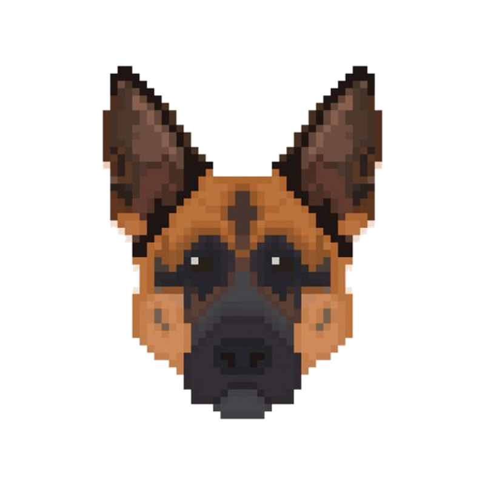

# DogEngine 0.0


<p>This repository holds the dogengine, a game engine made from stratch using C/C++ and opensource libraries. This project has been worked on since my second year at humber college north campus.<p> 

## How to clone my repository using gitbash
<h4> <h4>

```gitbash
    #clone repo in git bash  
    git clone https://github.com/Jairo411/SDL2D_Project.git
```


# Main features
<ul style="font-size:27px">
    <li>
 Concurrency 
    </li>
    <li>
 Entity Component System 
    </li>
    <li>
 Modern C++ Features C++14,C++17 
    </li>
    <li>
    OpenGL
    </li>
    <li>
    Platform Independent File I/O
    </li>
</ul>

# Credits 

<h3> Hello my name is Jairo Morelli, i'm currently a 3rd year student at humber.
I've spent my off time (up intil now) building the dog engine. My contact information will be down below.</h3>


<p>&nbsp</p>

<h2> Jairo Alberto Morelli (Game Engine Programmer / Generalist Programmer)</h2>

[github](https://github.com/Jairo411)
[linkedin](https://www.linkedin.com/in/jairo-morelli-b1018514b)
