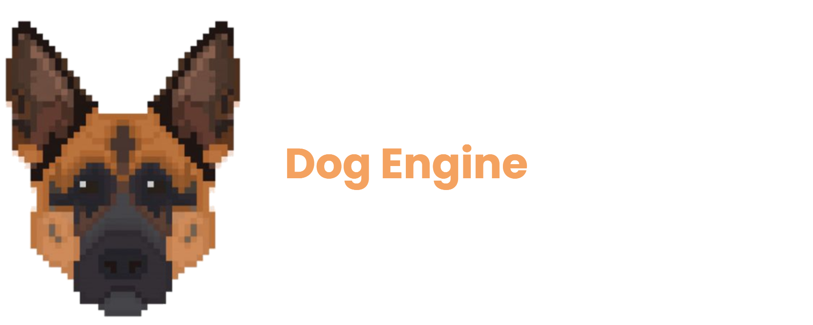

# DogEngine
  

The Dog Engine, is a  game engine that I started working on during 2019 in my days as a college student at humber college. I have gone through many trails and tribulations trying to finish this game engine, as well as many refactors. I am currently working on this engine again, to display what I've learn up to so far in my journey of programming for 6 years now. My plan is to have acouple stable releases of my game engine before I finish working on this project.

## DogEngine Features
* Entity Component System 
* C++17 standard library features  
* OpenGL 3D Graphics API 

## Current Tasks 
* Implementing  Engine Serializer
* Implementing Vulkan API 
* Implementing stable release of the DogEngine, with calendar versioning to distinguish current/future releases 
